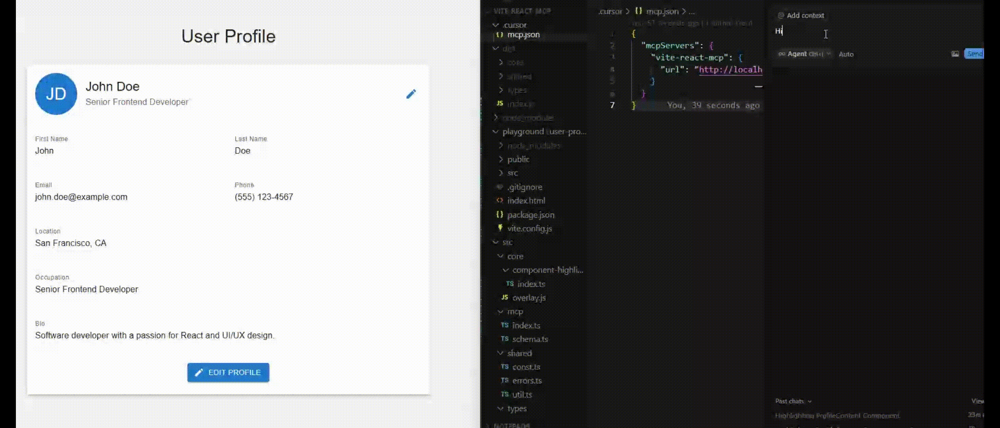
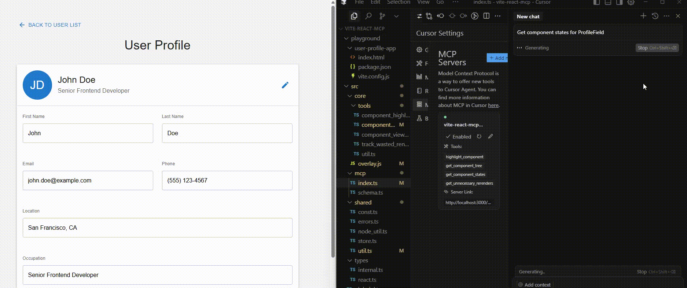
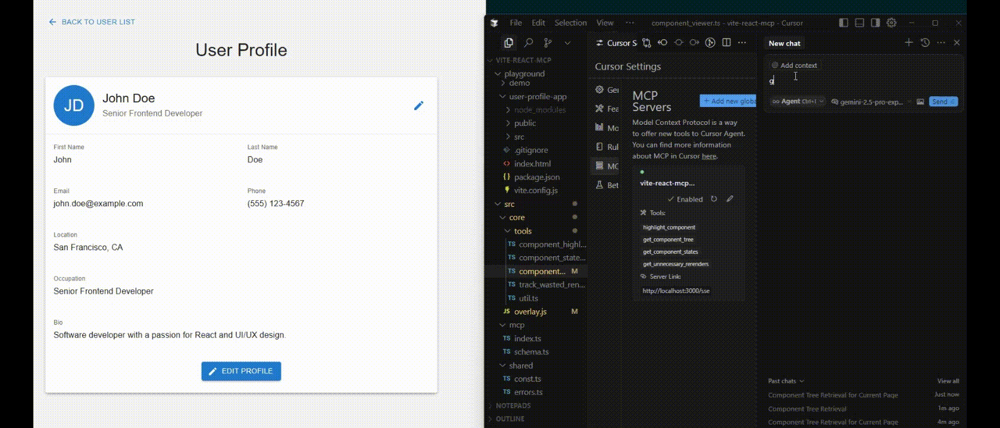
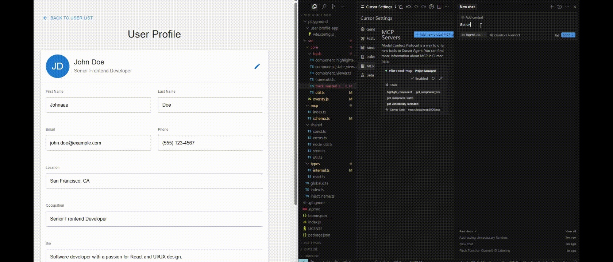

# @jazelly/agentic-react

[![npm version][npm-version-src]][npm-version-href]
[![npm downloads][npm-downloads-src]][npm-downloads-href]

A single dev-only React plugin that creates an MCP server to help LLMs understand your React app context across Vite, Webpack, and Next.js.

## Demo

<video src="./playground/demo/demo1-single-select.mp4" controls muted></video>

## Package

This repository publishes one npm package:

- `@jazelly/agentic-react`: default Vite integration, with Webpack and Next.js available through subpath exports.

## Features

- Single package for Vite, Webpack, and Next.js dev setups.
- Local MCP server exposed from your dev server or local bridge at `/sse`.
- Browser runtime globals for direct inspection: `window.__AGENTIC_REACT__` and `window.__AGENTIC_REACT_TOOLS__`.
- React component highlighting by component name.
- Live React component tree inspection.
- Props, state, and context inspection for selected components.
- Unnecessary re-render detection for the current page.
- DOM selection to React source context lookup.
- Custom browser tools that agents can call through MCP.

### Built-in MCP Tools

- `highlight-component`: highlight a React component by `componentName`.

  

- `get-component-states`: return props, state, and context for a React component.

  

- `get-component-tree`: return the current page's React component tree.

  

- `get-unnecessary-rerenders`: return wasted re-renders, optionally scoped by `timeframe`.

  

- Custom tools: register your own browser-side functions as MCP tools.

  

## Getting Started

### Installation

```bash
pnpm install @jazelly/agentic-react -D
```

### Vite

```ts
// vite.config.ts
import { defineConfig } from 'vite';
import AgenticReact from '@jazelly/agentic-react'

export default defineConfig({
  plugins: [AgenticReact()],
})
```

Run your Vite app in development. Agentic React is served from the same dev server, and the MCP endpoint is available at:

```text
http://localhost:<vite-port>/sse
```

### Webpack

```js
// webpack.config.mjs
import withAgenticReactWebpack from '@jazelly/agentic-react/webpack'

export default (env, argv) =>
  withAgenticReactWebpack(config, { mode: argv.mode })
```

Run your Webpack dev server. Agentic React adds the browser runtime entry and exposes MCP middleware from the same dev server:

```text
http://localhost:<webpack-dev-server-port>/sse
```

### Next.js

```js
// next.config.mjs
import withAgenticReactNext from '@jazelly/agentic-react/next'

export default withAgenticReactNext(nextConfig)
```

By default the Next.js adapter starts its local MCP bridge on:

```text
http://127.0.0.1:51426/sse
```

### MCP Client

After adding the Vite, Webpack, or Next.js integration, point your MCP client at the matching `/sse` URL.

Cursor example:

```json
{
  "mcpServers": {
    "@jazelly/agentic-react": {
      "url": "http://localhost:3000/sse"
    }
  }
}
```

Replace `3000` with your app's dev server port. For Next.js, use `http://127.0.0.1:51426/sse` unless you configured a different bridge port.

You can also access tools directly in the browser:

```js
window.__AGENTIC_REACT__
window.__AGENTIC_REACT_TOOLS__
```

### Custom Tools

Define your own tool in your Vite project, e.g.

```ts
// any ts file in your Vite project
import type { ToolResultValue } from '@jazelly/agentic-react';

export default function myCustomTool(args: { message: string }): ToolResultValue {
  const { message } = args;
  console.log(`[custom-tool/log1] ${message}`);
  return {
    success: true,
    message: `Log1 received: ${message}`,
  };
}
```

```ts
// vite.config.ts
import AgenticReact from '@jazelly/agentic-react'
import log1 from 'path/to/your/module'
import { z } from 'zod'

export default defineConfig({
  plugins: [AgenticReact({
    customTools: [
      {
        name: 'log1',
        description: 'Log1',
        schema: z.object({
          message: z.string(),
        }),
        clientFunction: log1,
      }
    ]
  })],
})
```

Then run your app in dev.
> Note: @jazelly/agentic-react is meant to be used in dev environment only

### How it works

This plugin injects a small browser runtime (`window.__AGENTIC_REACT__`) and bridges an MCP server with your React app, enabling LLMs to inspect and interact with your components in a live browser session. When an MCP client calls a tool, the MCP server forwards that request through the local runtime bridge into the browser, executes it against the live React tree, and returns the result back to the MCP client. Here's the full picture:

#### Architecture overview

```
MCP Client (Cursor, etc.)
     │
     │  SSE + HTTP POST (/sse, /messages)
     ▼
Vite Dev Server (Node.js)
  ├── MCP Server (handles tool listing & calls)
  └── HMR WebSocket
         │
         │  custom events via Vite HMR
         ▼
      Browser
  ├── overlay.js (tool implementations + WebSocket listeners)
  ├── bippy (React fiber access via __REACT_DEVTOOLS_GLOBAL_HOOK__)
  └── window.__AGENTIC_REACT_TOOLS__ (tool registry)
```

#### Step by step

1. **Browser-side injection (runtime)** — At dev startup, scripts are injected into the HTML `<head>`:
   - `overlay.js` is loaded as a module. It uses [bippy](https://github.com/nicholascostadev/bippy) to install a `__REACT_DEVTOOLS_GLOBAL_HOOK__` on `window`, giving direct access to the React fiber tree **without requiring the React DevTools browser extension**. It also hooks into React's commit lifecycle (`onCommitFiberRoot`) to continuously track fiber roots and detect unnecessary re-renders.
   - The overlay exposes all built-in tool functions (highlight, tree, states, re-renders) on `window.__AGENTIC_REACT_TOOLS__` and registers Vite HMR listeners (`import.meta.hot.on(...)`) for each tool.

2. **MCP server (SSE transport)** — When the Vite dev server starts, the plugin attaches two HTTP endpoints:
   - `GET /sse` — Establishes a long-lived Server-Sent Events connection with the MCP client.
   - `POST /messages?sessionId=<id>` — Receives JSON-RPC tool-call requests from the MCP client.

   The MCP server advertises all built-in and custom tools (with JSON Schema descriptions derived from their Zod schemas) so any MCP-compatible client can discover and invoke them.

3. **Tool call flow** — When an MCP client invokes a tool (e.g. `highlight-component`):
   1. The MCP server receives the JSON-RPC request via the `/messages` endpoint.
   2. It validates the arguments against the tool's Zod schema.
   3. It sends a custom event through Vite's HMR WebSocket to the browser (e.g. `highlight-component` with the serialized args).
   4. The browser-side HMR listener picks up the event, executes the tool function against the live React fiber tree, and sends the result back via another HMR event (e.g. `highlight-component-response`).
   5. The MCP server awaits this response, wraps it in a JSON-RPC result, and streams it back to the MCP client over SSE.

4. **Project ownership** — Component tree filtering, wasted-render filtering, and selection source lookup resolve ownership from React fiber source metadata. If a component resolves to source inside the app rather than dependency/internal code, Agentic React treats it as project-owned.

5. **Custom tools** — User-defined tools follow the same browser-runtime round trip, so browser-only handlers run in the page instead of the Node dev server. Their handler functions are registered in the browser at startup via dynamic `import()` or inline injection, and corresponding runtime listeners are created automatically.

### Test

```bash
pnpm run playground
```

The playground contains a simple user profile application to test React component interactions.

There is also an Nx-style module federation fixture for older enterprise
monorepos:

```bash
pnpm run playground:nx-mf
```

It lives in
[`playground/agentic-react-nx-module-federation-playground`](./playground/agentic-react-nx-module-federation-playground)
and models a pnpm-managed Nx 15 monorepo with one root `package.json`, a shell
host, multiple remotes, app-level `project.json` files, app-level
`module-federation.config.js` files, root `module-federation.js` project-graph
remote resolution, and root `webpack.config.base.js` environment filtering. It
uses `@nrwl/webpack:webpack`, Webpack 5 Module Federation, React 18.2.0, React
DOM 18.2.0, React Router DOM 6.4.2, TypeScript 4.8.4, Babel, ESLint, and a
legacy React 17 dependency edge.

For e2e automation, Playwright uses a fixed local dev port (`51423`) configured in
[`playground/agentic-react-vite-playground/vite.config.js`](./playground/agentic-react-vite-playground/vite.config.js)
and
[`playground/agentic-react-vite-playground/playwright.config.js`](./playground/agentic-react-vite-playground/playwright.config.js).

Dependency versions in this package intentionally keep semver ranges for integration libraries (for example `bippy`) and use the workspace lockfile (`pnpm-lock.yaml`) for reproducible installs.

## Acknowledgement

This project is inspired by [vite-plugin-vue-mcp](https://github.com/webfansplz/vite-plugin-vue-mcp). Thanks for the awesome idea bridging mcp and devtools.


## License

MIT

[npm-version-src]: https://img.shields.io/npm/v/@jazelly/agentic-react?style=flat&colorA=080f12&colorB=1fa669
[npm-version-href]: https://npmjs.com/package/@jazelly/agentic-react
[npm-downloads-src]: https://img.shields.io/npm/dm/@jazelly/agentic-react?style=flat&colorA=080f12&colorB=1fa669
[npm-downloads-href]: https://npmjs.com/package/@jazelly/agentic-react
