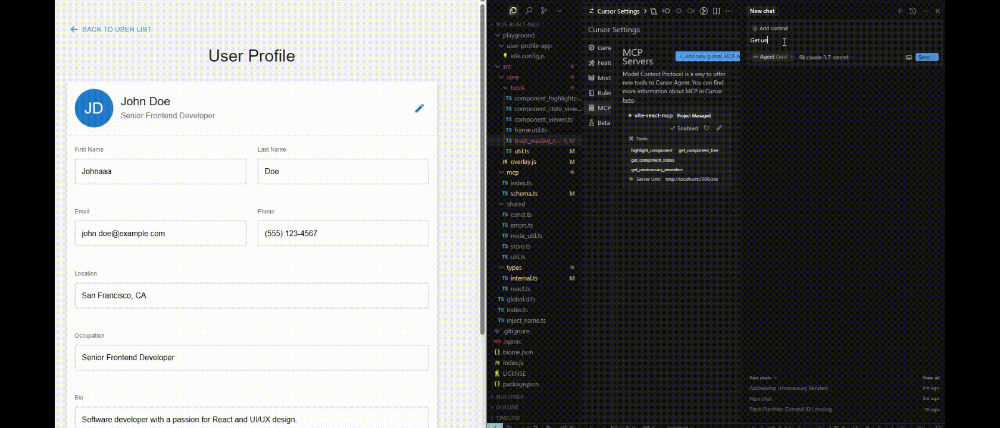

# vite-react-mcp

A Vite plugin that creates an MCP server to help LLMs to understand your React App context

## Features

- `highlight-component`
  - description: Highlight React component based on the component name.
  - params: 
    - `componentName`: string


- `get-component-tree`
  - description: Get a tree-like representation of the component tree of the current page.
  - params:
    - `selfOnly`: boolean, if true, return the components related to your self defined components only

- `get-unnecessary-rerenders`
  - description: Get the wasted re-rendered components of the current page
  - params:
    - `timeframe`: number, if present, only get unnecessary renders within the last `timeframe` seconds
    - `allComponent`: boolean, if truthy, get unnecessary renders for all components instead of self-defined components only.



## Getting Started

### Installation

```bash
pnpm install vite-react-mcp -D
```

### Usage

```ts
// vite.config.ts
import ReactMCP from 'vite-react-mcp'

export default defineConfig({
  plugins: [ReactMCP()],
})
```

### Test

```bash
pnpm run playground
```

The playground contains a simple user profile application to test React component interactions.


## License

MIT 